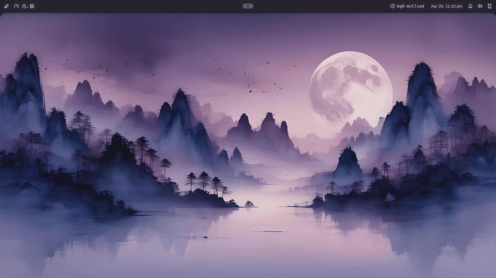

```
 __  __       _ _   _        _               _
|  \/  |     | | | (_)      | |             | |
| \  / |_   _| | |_ _ ______| |__   ___  ___| |_
| |\/| | | | | | __| |______| '_ \ / _ \/ __| __|
| |  | | |_| | | |_| |      | | | | (_) \__ \ |_
|_|  |_|\__,_|_|\__|_|_____ |_| |_|\___/|___/\__|                _
| \ | (_)     / __ \ / ____|     / / |  __ \                    (_)
|  \| |___  _| |  | | (___      / /  | |  | | __ _ _ ____      ___ _ __
| . ` | \ \/ / |  | |\___ \    / /   | |  | |/ _` | '__\ \ /\ / / | '_ \
| |\  | |>  <| |__| |____) |  / /    | |__| | (_| | |   \ V  V /| | | | |
|_|_\_|_/_/\_\\____/|_____/  /_/     |_____/ \__,_|_|    \_/\_/ |_|_| |_|
 / ____|           / _(_)
| |     ___  _ __ | |_ _  __ _
| |    / _ \| '_ \|  _| |/ _` |
| |___| (_) | | | | | | | (_| |
 \_____\___/|_| |_|_| |_|\__, |
                          __/ |
                         |___/
```



# Repository Layout

```text
.
├── flake.nix
├── flake.lock
├── hosts/
│   ├── darwin/
│   │   └── mac-mini/
│   └── nixos/
│       ├── chromebook/
│       ├── desktop-pc/
│       └── nas/
├── lib/
├── media/
└── modules/
    ├── darwin/
    ├── nixos/
    └── shared/
        └── dotfiles/
```

# Key Features

- Shared theme and desktop defaults across NixOS and Darwin hosts through the
  common module stack and Stylix.
- Shared set of apps and CLI tooling across platforms, including shell,
  editor, terminal utilities, and development tools.
- Auto host discovery. Just add the new host to the platform-specific directory.
- Individual host overrides layered on top of the shared base, so each machine
  keeps its own hardware config, role-specific services, and platform details.
- Optional in-repo dotfiles support which automatically symlinks configs and scripts.
- Split-repo-friendly builder functions under `lib/`, making it easy to keep
  reusable modules public while moving real inventory and secrets to a private
  wrapper.
- Examples that include: hyprland, noctalia-shell, sunshine/moonlight, jellyfin,
  and neovim.

# Module Layers

Configurations are assembled in this order:

1. shared base modules
2. platform base modules
3. user module
4. home-manager wiring
5. host-specific modules

# Example Hosts

- `chromebook`: a laptop-oriented NixOS host
- `desktop-pc`: a desktop/gaming-oriented NixOS host
- `nas`: a NixOS media/storage host
- `mac-mini`: a nix-darwin workstation

# Standalone Usage

When using this repository directly, the checked-in hosts are available as flake
outputs under `nixosConfigurations` and `darwinConfigurations`.

## Update package inputs

Update all flake inputs:

```bash
nix flake update
```

## Rebuild/Switch a host

Apply a NixOS host configuration on the target machine:

```bash
sudo nixos-rebuild switch --flake .#desktop-pc
```

Apply a nix-darwin host configuration on the target machine:

```bash
sudo darwin-rebuild switch --flake .#mac-mini
```

Replace the host name with any checked-in standalone host, such as
`chromebook`, `desktop-pc`, `nas`, or `mac-mini`.

# Split Model

You can use this repository in two ways:

1. Fork this repo and add hosts/dotfiles directly.
2. As a flake input for a private repo (what I do).

## Example Private Wrapper

```nix
{
  description = "Private host inventory for my shared Nix config";

  inputs = {
    nix-config.url = "github:jdysinger/nix-config";
    sops-nix = {
      url = "github:Mic92/sops-nix";
      inputs.nixpkgs.follows = "nix-config/nixpkgs";
    };
    dotfiles = {
      url = "path:../dotfiles";
      flake = false;
    };
  };

  outputs =
    {
      self,
      nix-config,
      sops-nix,
      dotfiles,
      ...
    }:
    let
      hostsRoot = self + "/hosts";
      username = "your-user";
      dotfilesSrc = dotfiles;
      privatePackagesOverlay = final: prev: {
        # private packages here
      };
    in
    {
      nixosConfigurations = nix-config.lib.mkConfigurationsFromHosts {
        platform = "nixos";
        inherit hostsRoot username dotfilesSrc;
        extraOverlays = [ privatePackagesOverlay ];
        extraHomeManagerModules = [ sops-nix.homeManagerModules.sops ];
      };

      darwinConfigurations = nix-config.lib.mkConfigurationsFromHosts {
        platform = "darwin";
        inherit hostsRoot username dotfilesSrc;
        extraOverlays = [ privatePackagesOverlay ];
        extraHomeManagerModules = [ sops-nix.homeManagerModules.sops ];
      };
    };
}
```
